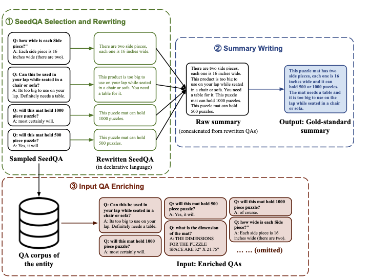

# MegagonLabs_QA_summarization
QA summary

**"amazon_qa_filtered_5_150_8q.csv":** selected 8 QA pairs for rewrite

**"amazon_qa_summary_all.json":** QA summary include augmented data and mturk rewrite

**"mturk_best_rewrite.json":** best QA rewrite data

**"qa_annotated_summary_full.json":** QA rewrite data include error evaluation

**"model_config.txt":** transformer-based model training script. Reference Hugginface [summarization repo](https://github.com/huggingface/transformers/tree/master/examples/pytorch/summarization). 

**"sample_data":** data format for transformer-based model experiment.

**"transformer_summarization.py":** main part for transformer-based model experiment. Further modification needed.

**"baseline_summerize.py":** unsuperived methods (e.g. lexrank, sumbasic) and evaluation. 

**"train_led.py":** Fine-tuned LED Pretrained Model. Trained with our own training data.

----


# CoolDatasetName

This respository hosts a benchmark dataset for QA summarization. 

QA summarization is the task of making a summary from multiple Question-Answer (QA) pairs about a single product. The most challenging part is that salient information is often spread in question and answer, so the model has to appropriately extract salient information from multiple QA pairs. 

The dataset is based on the Amazon QA datset (link).


## Annotation Framework

Since collecting summaries for a large number of QA pairs is not feasible, <DATASETNAME> employed an annotation framework that consists of the following 3 steps. 

- **Step 1 (QA rewriting)**: Annotators rewrite each QA pair into sentences in a declarative form.
- **Step 2 (Summary writing)**: Annotators write a summary from sentences edited in Step 1.
- **Step 3 (Input QA pair enrichment)**: Additional QA pairs that are semantically similar to the QA pairs used in Steps 1 and 2 were collected.

TODO: Probably, it's better to make the Summary writing step Step 2 instead of Step 3. 




## Benchmark datasets 


## Data Format 

`amazon_qa_summary_filtered.json` contains all types of annotations and the original QA data.

The JSON file contains a list of dictionary objects (`List[Dict]`), each of which corresponds to one product.
The JSON schema is described below. 

- `asin (str)`: Product ID 
- `url (str)`:
- `category (str)`
- `qa_pair (List[Dict])`:
    - `qid (str)`: Question ID
    - `qaid (str)`: QA pair ID
    - `questionType (str)`: {"open-ended", "yes/no"}
    - `question (str)`: The original question text
    - `answer (str)`: The original answer text
    - `qa_index (int)`: The index of QA pair for the question (0 origin).
    - `post_collection(Dict)`: (*1)
        - `original_qa (str)`: The original QA pair ID that was used to collect this QA pair. 
        - `method (str)`: The method that was used to collect this QA pair.     
    - `annotation (List[Dict])`: (*1)
        - `edit (str)`: Edited sentence in a declartive form.
        - `is_selected (bool)`: True if the edited sentence was used for the summary writing task. False otherwise. 
        - `error_score (int)`: Higher `error_score` indicates the sentence has more issues. 
        - `wid (str)`: Worker ID.
    - `summary (List[str])`: Reference summary written in the summary writing task. 

(*1) Each dictionary in `qa_pair` has either `annotation` or `post_collection`.  If one has `annotation`, the QA pair was shown to annotators for the first QA rewriting task. If an entry does not have `annotation`, it means that the entry was collected through the QA-pair enrichment step. Then, the entry should have `post_collection`, which contains the original QA pair ID and the method that were used to collect the entry. 

```json
[
    {
        "asin": "B000FCURJC"
        "url": ""
        "category": "Toys_and_Games",
        "qa_pair": [
            {
                "qid": "A27L01Z2L7C6TW#0",
                "qaid": "A27L01Z2L7C6TW#0_A37E4725NQUAAR#0"
                "questionType": "open-ended",
                "question": "What are the dimensions of the puzzle space?",
                "answer": "THE DIMENSIONS FOR THE PUZZLE SPACE ARE 32\" X 21.75\"",
                "post_collection": null,
                "qa_index": 0,
                "annotation": {
                    "rewrite": [
                        {
                            "edit": "The dimensions for the puzzle space are 32\" x 21.75\"",
                            "is_selected": "False",
                            "error score": 0,
                            "wid": "A12DXWDNOBY503"
                        },
                        {
                            "edit": " THE DIMENSIONS FOR THE PUZZLE SPACE ARE 32\" X 21.75\"",
                            "is_selected": "False",
                            "error score": 1,
                            "wid": "A3D1PXOYFFN1MM"
                        },
                        ...
                        {
                            "edit": "The dimensions of the puzzle space are 32\" X 21.75\"",
                            "is_selected": "True",
                            "error score": 0,
                            "wid": "A1ZTCXQ6JAT7E8"
                        }
                    ]
                }
            },
            {
                "qid": "A27L01Z2L7C6TW#0",
                "qaid": "A27L01Z2L7C6TW#0_A37E4725NQUAAR#0",
                "questionType": "open-ended",
                "question": "What are the dimensions of the puzzle space?",
                "answer": "22x62 which includes the extensions",
                "post_collection": {
                    "original_qa": "A27L01Z2L7C6TW#0_A37E4725NQUAAR#0",
                    "method": "same_q_similar_a_lcs_0.1"
                }
            },
            ...
        "summary": [
            "The product is several rigid boards. The pieces can be arranged in the middle and on two side pieces. Pick up the side pieces to place them atop the middle area before folding the wings in. The mat will holds puzzles that have up to 1000 pieces. A 24 x 30 inch puzzle could be too small for the product to hold. The 1500 size should be used. Each side pieces are 16\" wide and the two inserts are 15-1/4 wide. The size of the closed unit is 32.25 x 22. If the center area for putting the puzzle together is in, then the leftover pieces should go on the 2 pieces that fit on top of the puzzle when the product is close up."
        ]
    },
    {
        "asin": "B000FKCYAO",
        "url": "",
        "category": "Toys_and_Games",
        "qa_pair": [
            ...
        ]
    }            
]
```

## Sample code

```python
import json

products = json.load(open(filepath))
for product in products:
    # Input QA pairs
    input_qa_pairs = []
    for qa_pair in product["qa_pair"]:
        input_qa_pairs.append({"Q": qa_pair["question"],
                                "A": qa_pair["answer"] })

    # Generate a summary from QA pairs
    generated_summary = summarizer(input_qa_pairs)

    # Reference summaries
    reference_summaries = product["summary"]
```

## Dataset Statistics

### Product category distribution

|                             |   # of products |
|:----------------------------|----------------:|
| Electronics                 |             304 |
| Home_and_Kitchen            |             262 |
| Sports_and_Outdoors         |             163 |
| Tools_and_Home_Improvement  |             138 |
| Automotive                  |              95 |
| Cell_Phones_and_Accessories |              94 |
| Health_and_Personal_Care    |              80 |
| Patio_Lawn_and_Garden       |              70 |
| Office_Products             |              66 |
| Toys_and_Games              |              54 |
| Musical_Instruments         |              22 |
| Grocery_and_Gourmet_Food    |              22 |
| Beauty                      |              20 |
| Baby                        |              17 |
| Video_Games                 |              12 |
| Pet_Supplies                |              11 |
| Clothing_Shoes_and_Jewelry  |              10 |
| Total                       |            1440 |

### Question type distribution

|                             |   open-ended |   yes/no |   total |
|:----------------------------|-------------:|---------:|--------:|
| Electronics                 |         6433 |     1410 |    7843 |
| Home_and_Kitchen            |         6669 |      907 |    7576 |
| Sports_and_Outdoors         |         3666 |      892 |    4558 |
| Tools_and_Home_Improvement  |         3198 |      607 |    3805 |
| Automotive                  |         2031 |      608 |    2639 |
| Cell_Phones_and_Accessories |         1953 |      609 |    2562 |
| Health_and_Personal_Care    |         1921 |      296 |    2217 |
| Patio_Lawn_and_Garden       |         1712 |      261 |    1973 |
| Office_Products             |         1461 |      330 |    1791 |
| Toys_and_Games              |         1225 |      234 |    1459 |
| Beauty                      |          487 |       81 |     568 |
| Grocery_and_Gourmet_Food    |          460 |       75 |     535 |
| Musical_Instruments         |          421 |      109 |     530 |
| Baby                        |          460 |       45 |     505 |
| Video_Games                 |          263 |       68 |     331 |
| Pet_Supplies                |          252 |       55 |     307 |
| Clothing_Shoes_and_Jewelry  |          236 |       50 |     286 |
| Total                       |        32848 |     6637 |   39485 |

